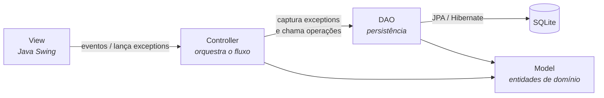

# ⚖️ CheckLawyer

> Sistema desktop de gestão para escritórios de advocacia — controle de clientes, processos, audiências e financeiro em um só lugar.


---

##  Sobre o projeto

O **CheckLawyer** é uma aplicação desktop desenvolvida em **Java** que centraliza a rotina administrativa de um escritório de advocacia. A proposta é substituir controles manuais (planilhas e anotações avulsas) por um sistema único que organiza clientes, processos, audiências e o fluxo financeiro, com validação de dados e persistência em banco.

O projeto foi construído como trabalho acadêmico da disciplina de **Desenvolvimento Orientado a Objetos (DOO2)** do curso de **Engenharia de Software da UDESC**, com foco em aplicar boas práticas de POO e uma arquitetura em camadas bem definida.

---

##  Funcionalidades

- **Gestão de Clientes** — cadastro de **Pessoa Física** e **Pessoa Jurídica** em um mesmo fluxo, com endereço completo e validação de CPF/CNPJ, e-mail e telefone.
- **Gestão de Processos** — vínculo de processos a clientes, com área do direito, vara/tribunal, status (em andamento, encerrado, arquivado) e data de abertura.
- **Gestão de Audiências** — registro de audiências com data, hora, local e pauta, associadas ao processo correspondente.
- **Controle Financeiro** — lançamento de receitas e despesas (honorários, formas de pagamento e status), com cálculo de saldo.
- **Ordenação e busca** — listagem de clientes com ordenação por nome e por ID.
- **Validação centralizada** — mensagens de erro claras para campos obrigatórios, formatos inválidos e registros duplicados.

---

##  Arquitetura

O sistema segue o padrão **MVC (Model–View–Controller)** combinado com o padrão **DAO (Data Access Object)** para isolar o acesso ao banco de dados.



**Responsabilidade de cada camada:**

- **Model** — entidades de domínio (`ClienteModel`, `ProcessoModel`, `AudienciaModel`, `PagamentoModel`, `EnderecoModel`), mapeadas com anotações JPA.
- **View** — telas em Java Swing. Além de montar a interface, **valida os dados de entrada e lança exceptions** quando algo está inválido.
- **Controller** — recebe os eventos da View, **captura e trata as exceptions**, aciona os DAOs e coordena a atualização das telas.
- **DAO** — encapsula toda a persistência (inserir, excluir, listar, verificar duplicidade) por meio de uma interface genérica `PersistivelInterface<T>`.

###  Tratamento de exceções

Um dos destaques do projeto é o fluxo padronizado de erros: **a View lança, o Controller trata.**

- A **View** valida cada campo em seus *getters* e lança exceptions customizadas (`CampoVazioException`, `FormatoInvalidoException`, `ValorNegativoException`, `SelecionarItemException`).
- O **Controller** apenas lê os dados dentro de um bloco `try/catch` e exibe a mensagem adequada ao usuário.
- Regras que dependem do banco de dados (como `RegistroDuplicadoException`) permanecem no Controller, evitando que a View acesse a camada de persistência e preservando a separação do MVC.

---

##  Conceitos de POO aplicados

- **Herança e Polimorfismo** — `ClienteFisicoModel` e `ClienteJuridicoModel` estendem `ClienteModel`, tratados de forma unificada nas listagens.
- **Interfaces e Generics** — `PersistivelInterface<T>` define o contrato de persistência reutilizado por todos os DAOs.
- **Comparable / Comparator** — ordenação de clientes por diferentes critérios (nome e ID).
- **Collections Framework** — uso de `List`, `Map` e `Set` no gerenciamento das entidades.
- **Exceptions customizadas** — hierarquia própria de exceções para uma validação expressiva e legível.
- **Encapsulamento e camadas** — separação clara de responsabilidades entre View, Controller, Model e DAO.

---

##  Tecnologias

| Categoria | Tecnologia |
|---|---|
| Linguagem | Java 17+ |
| Interface gráfica | Java Swing |
| Persistência (ORM) | Hibernate 6 (Jakarta Persistence / JPA) |
| Banco de dados | SQLite |
| Gerenciador de dependências | Maven |

---

##  Estrutura do projeto

```
CheckLawyer/
├── src/main/java/
│   ├── Main/          # Ponto de entrada da aplicação
│   ├── Model/         # Entidades de domínio (JPA)
│   ├── View/          # Telas em Java Swing
│   ├── Controller/    # Coordenação e tratamento de exceptions
│   ├── Dao/           # Acesso a dados (DAO + PersistivelInterface)
│   ├── Exception/     # Exceptions customizadas
│   └── Util/          # JPAUtil (gerência do EntityManager)
├── src/main/resources/META-INF/persistence.xml
└── pom.xml
```

---

## ▶️ Como executar

### Pré-requisitos
- **JDK 17** ou superior
- **Maven** instalado

### Passos

```bash
# 1. Clone o repositório
git clone https://github.com/<usuario>/CheckLawyer.git
cd CheckLawyer

# 2. Compile e gere o JAR com dependências
mvn clean package

# 3. Execute a aplicação
java -jar target/CheckLawyer-1.0-SNAPSHOT-jar-with-dependencies.jar
```

>  Também é possível abrir o projeto diretamente em uma IDE (IntelliJ IDEA / Eclipse) e executar a classe `Main.Main`.

### Banco de dados
Não é necessária nenhuma configuração manual: o arquivo `checklawyer.db` (SQLite) é **criado e atualizado automaticamente** na primeira execução, via `hibernate.hbm2ddl.auto = update`.

---

##  Equipe

Projeto desenvolvido em grupo:

- [@nicollasmoura0102]([https://github.com/usuario](https://github.com/nicollasmoura0102)).*</sub>
- [@Nicolas Zanella](https://github.com/NZzc).*</sub>

---

##  Contexto acadêmico

Trabalho desenvolvido para a disciplina **Desenvolvimento Orientado a Objetos II (DOO2)** — Curso de **Engenharia de Software**, **UDESC**.

---

<sub>Projeto de fins educacionais.</sub>
